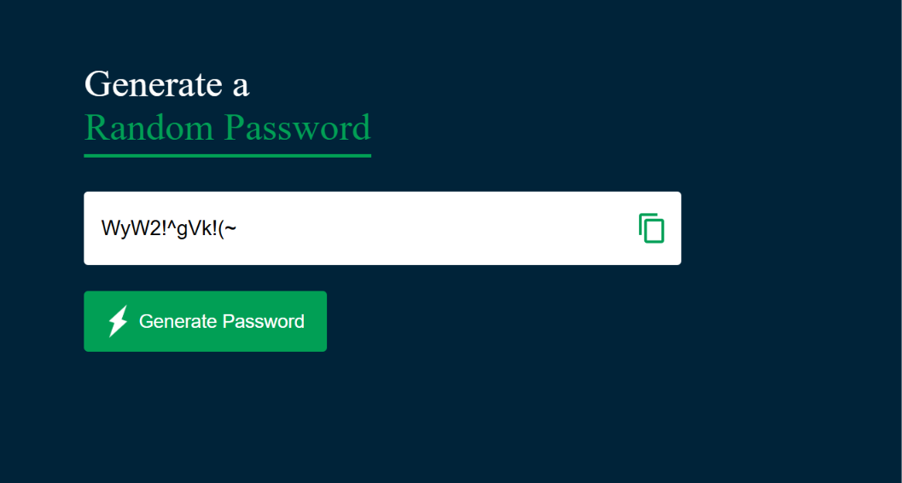

# 🔐 Random Password Generator

A clean and responsive **Random Password Generator** built with pure **HTML**, **CSS**, and **JavaScript**. Instantly generate strong and secure passwords containing uppercase letters, lowercase letters, numbers, and symbols with one click.

---

## 🖼️ Preview



---

## ✨ Features

* 🔑 Generate secure random passwords
* 🔠 Includes uppercase & lowercase letters
* 🔢 Includes numbers
* 🔣 Includes special symbols
* 📋 One-click copy to clipboard
* 🎨 Modern and minimal UI design
* ⚡ Fast and lightweight

---

## 📁 Project Structure

```txt id="j3x2ma"
PasswordGenerator/
├── index.html
├── style.css
├── script.js
├── preview.png
└── images/
    ├── copy.png
    └── generate.png
```

---

## 🚀 Getting Started

### 1. Clone the repository

```bash id="7s8fpm"
git clone https://github.com/your-username/password-generator.git
```

### 2. Open the project folder

```bash id="z9e4h1"
cd password-generator
```

### 3. Run the project

Simply open `index.html` in your browser.

---

## ⚙️ How It Works

The password generator:

* Ensures at least:

  * 1 uppercase letter
  * 1 lowercase letter
  * 1 number
  * 1 symbol
* Randomly fills the remaining characters
* Shuffles the final password for better randomness

Default password length:

```js id="9l7qwe"
const length = 12;
```

You can change the password length by updating this value in `script.js`.

---

## 📋 Copy Password

Click the copy icon to copy the generated password to your clipboard instantly

```js id="m2v8na"
navigator.clipboard.writeText(passwordBox.value);
```

---

## 🎨 Styling Highlights

| Feature      | Detail                           |
| ------------ | -------------------------------- |
| Background   | Dark navy blue theme             |
| Accent Color | Green (`#019f55`)                |
| Layout       | Responsive centered container    |
| Buttons      | Modern flex alignment with icons |
| Password Box | Clean white contrast card        |

---

## 🛠️ Technologies Used

* HTML5
* CSS3
* JavaScript (Vanilla JS)

---

## 💡 Future Improvements

* 🔢 Custom password length slider
* ☑️ Toggle symbols/numbers
* 👁️ Show/hide password
* 📱 Improved mobile responsiveness
* 🔔 Copy success notification

---

## 🙋‍♀️ Author

**Kaneeza Batool**
CS Undergraduate · Sukkur, Pakistan
Built with 🔐 using HTML, CSS & JavaScript
